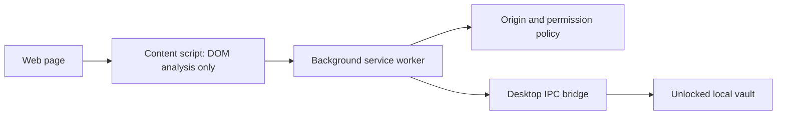

# Browser Extension Architecture

## Responsibilities

- Detect login, password change, passkey, and TOTP fields.
- Validate origins before requesting or filling credentials.
- Enforce per-site vault access grants.
- Isolate secrets in the background context and avoid persistent secret storage.
- Communicate securely with the desktop app.
- Support Chromium and Firefox with minimal permissions.

## Runtime Model

## Permission Strategy

MVP permissions:

- `activeTab`
- `scripting`
- Native messaging permission for the desktop bridge
- Optional host permissions requested per site

The extension must not use `localStorage` for secrets. Session-only state should use memory in the background context, with re-authentication after browser restart.

## Autofill Security

- Match effective top-level site and frame origin.
- Reject mixed-content or suspicious origin transitions.
- Require explicit user approval for new domains, subdomain wildcards, and iframes.
- Never inject credentials into hidden, disabled, or offscreen fields without user confirmation.

