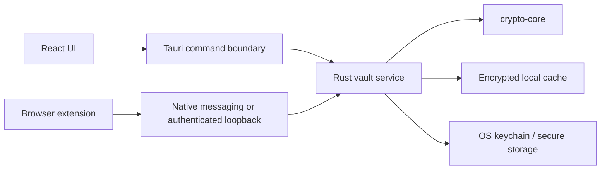

# Desktop App Architecture

## Responsibilities

- Vault unlock, lock, and encrypted local cache.
- Password generation and TOTP rendering.
- Secure notes and multi-vault management.
- Auto-lock on idle, sleep, screen lock, and policy events.
- Clipboard auto-clear with user-configurable maximums.
- Biometric unlock through OS secure storage.
- Hardware key support through WebAuthn/FIDO2.
- Secure IPC broker for browser extension.

## Process Model

## Security Controls

- Secrets stay in Rust-owned buffers where possible and are zeroized after use.
- The UI receives plaintext only when needed for rendering or user action.
- Clipboard writes include expiry metadata and a clearing task.
- IPC messages include extension identity, origin context, monotonic nonce, and session binding.
- Local cache is encrypted with a key protected by the user-derived vault key and OS secure storage where available.

## MVP Milestones

1. Tauri shell with locked/unlocked states.
2. Rust command interface for derive/encrypt/decrypt smoke tests.
3. Encrypted local vault cache.
4. Auto-lock and clipboard clearing.
5. Native messaging bridge for extension.

