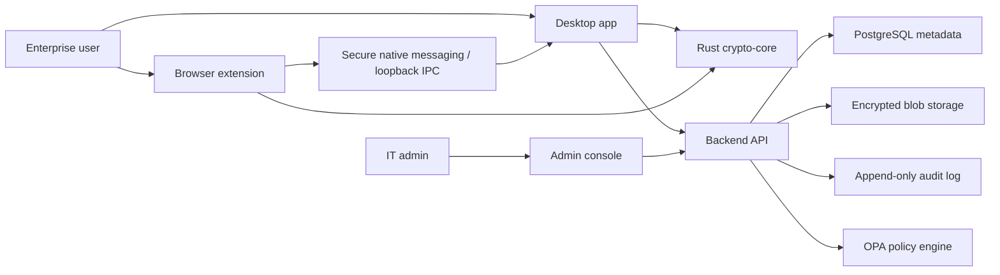

# ESPASS High-Level Architecture

## Goals

ESPASS protects enterprise credentials, secure notes, TOTP seeds, passkeys, and vault metadata with a zero-knowledge design. Clients encrypt and decrypt vault data locally. The backend authenticates users, synchronizes encrypted blobs, enforces enterprise policy, and records audit events without receiving plaintext secrets or usable encryption keys.

## System Context

## Trust Boundaries

| Boundary | Trusted Side | Untrusted or Less Trusted Side | Control |
| --- | --- | --- | --- |
| Client crypto core to backend | Client memory while unlocked | Network, API, storage | TLS, certificate pinning where appropriate, AEAD, signature checks |
| Extension to page DOM | Extension isolated world/background | Web page scripts and DOM | Minimal permissions, origin validation, no secret storage in content scripts |
| Desktop IPC | Desktop app and registered extension | Local processes | Authenticated messages, per-origin grants, replay protection |
| Admin policy to vault contents | Enterprise metadata | User vault plaintext | Policies operate on metadata and client-enforced controls |

## Major Components

### Desktop App

Tauri shell with React + TypeScript UI and Rust commands for security-sensitive operations. It owns local encrypted vault cache, OS secure storage integration, auto-lock, clipboard clearing, biometric unlock orchestration, hardware key integration, and extension IPC broker duties.

### Browser Extension

TypeScript WebExtension targeting Chromium and Firefox. The background service worker/session context mediates all vault access. Content scripts perform page analysis and field interaction without retaining secrets. Autofill requires origin validation, anti-phishing checks, and per-site permissions.

### Backend API

Rust service using Axum for secure REST APIs and WebSocket sync. PostgreSQL stores users, teams, devices, sessions, encrypted vault records, audit metadata, and policy configuration. Object storage holds larger encrypted blobs. The backend never receives plaintext vault items or master passwords.

### Crypto Core

Rust crate shared through native bindings where appropriate. Responsibilities include password key derivation, random salt and nonce generation, AEAD encryption/decryption, envelope format validation, secure zeroization, and future support for sharing keys with X25519/libsodium sealed boxes.

### Sync Engine

Offline-first encrypted state synchronization using item versions, conflict records, signed device state, and server-side opaque revision tokens. Conflict resolution happens client-side because only clients can decrypt vault records.

## Data Model Summary

The backend stores:

- User identity and enterprise membership metadata.
- Device registrations and public keys.
- Session records and refresh token hashes.
- Encrypted vault blobs and item-level encrypted records.
- Audit events that avoid secret material.
- Admin policy documents.

The backend does not store:

- Master passwords.
- Raw key-encryption keys.
- Vault data-encryption keys in plaintext.
- Decrypted vault items.
- TOTP seeds in plaintext.

## Deployment Model

Local development uses Docker Compose with PostgreSQL, backend, and observability services. Production targets Kubernetes with separate namespaces for API, workers, monitoring, and policy services. Secrets are injected through a cloud KMS-backed secrets manager, never through committed files.

