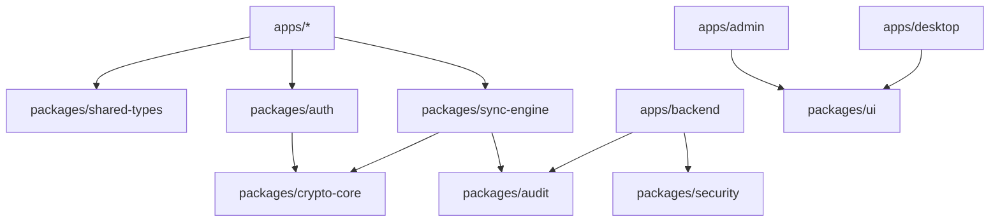

# Repository Structure

ESPASS uses a modular monorepo. Security-sensitive primitives live in Rust packages; product surfaces consume them through narrow APIs.

```text
apps/
  desktop/
  extension/
  backend/
  admin/
  future-mobile/
packages/
  crypto-core/
  shared-types/
  auth/
  ui/
  security/
  audit/
  sync-engine/
infrastructure/
  docker/
  k8s/
  terraform/
  monitoring/
docs/
  architecture/
  threat-model/
  security/
  compliance/
  api/
  incident-response/
agents/
  security-agent/
  red-team-agent/
  architecture-agent/
  compliance-agent/
  qa-agent/
```

## Dependency Direction



Rules:

- `crypto-core` has no dependency on application code.
- Backend code cannot import client plaintext vault types.
- Extension content scripts cannot import modules that persist secrets.
- Audit events must use redacted schemas from `packages/audit`.

