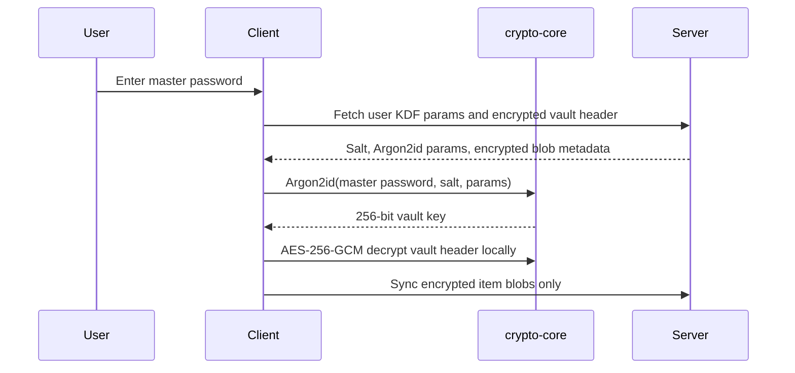

# Cryptographic Design

## Principles

- ESPASS uses established primitives through reviewed libraries.
- Cryptographic code is isolated in `packages/crypto-core`.
- The server is not trusted with plaintext secrets or usable client encryption keys.
- Every encrypted payload is authenticated with associated data to bind context.
- Random salts and nonces are generated by the operating system CSPRNG.

## Password-Based Vault Unlock



## Current MVP Primitive Choices

| Use | Primitive | Rationale |
| --- | --- | --- |
| Master password KDF | Argon2id | Memory-hard, recommended for password hashing and key derivation |
| Vault item encryption | AES-256-GCM | Widely reviewed AEAD, hardware acceleration on common platforms |
| Salt | 128-bit random | Unique KDF salt per account/vault context |
| Nonce | 96-bit random | Standard GCM nonce size; generated randomly per encryption |
| Memory cleanup | `zeroize` | Best-effort wiping of sensitive buffers on drop |
| Memory locking | `mlock` / `VirtualLock` | Best-effort swap-resistance for live secret buffers |

## Key Hierarchy

```text
Master password
  -> Argon2id with account salt
    -> Key-encryption key (KEK)
      -> decrypts vault data-encryption key envelope
        -> vault data-encryption key (DEK)
          -> encrypts vault items, notes, TOTP seeds, and local cache records
```

MVP `crypto-core` exposes generic key derivation and AEAD envelope encryption. The full key hierarchy will be layered above this package in `packages/auth` and `packages/sync-engine`.

## Runtime Key Types

`crypto-core` now separates key material into non-clonable types:

- `MasterKey`: password-derived key-encryption key.
- `VaultKey`: vault data-encryption key.
- `DeviceKey`: device-local symmetric protection key.
- `SessionKey`: ephemeral session or IPC key.

These types redact `Debug`, zeroize on drop, support best-effort memory locking, and require explicit conversion from byte arrays at trust boundaries.

## Associated Data

Associated data must include immutable context such as:

- ESPASS envelope version.
- Tenant ID where available.
- Vault ID.
- Item ID.
- Record type.

Changing associated data invalidates authentication and prevents ciphertext replay across contexts.

## Nonce Safety

AES-GCM security requires no nonce reuse for the same key. ESPASS generates random 96-bit nonces using the OS CSPRNG and stores each nonce inside the encrypted envelope. Future high-volume batch encryption may use deterministic nonce allocation with durable counters inside the sync engine.

## Future Sharing Design

Secure sharing will use per-device public keys and sealed key envelopes:

- Device identity keys are generated client-side.
- Public keys are registered with the backend.
- Vault/item sharing encrypts a DEK copy to each recipient device public key.
- Revocation rotates affected DEKs and re-encrypts accessible records.
