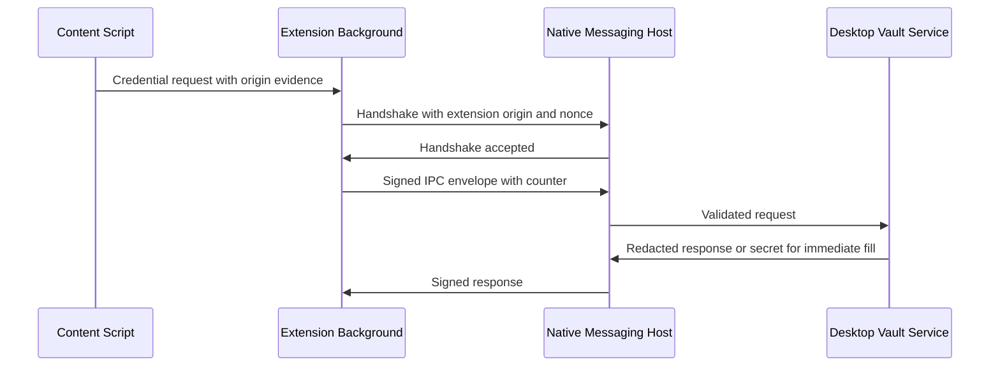

# Native Messaging and IPC Security

## Trust Boundary

The browser extension and desktop app are separate principals. Web page content is untrusted. Content scripts may inspect DOM fields but must not retain vault secrets. The desktop vault service is the only component allowed to request decrypted credentials from an unlocked vault.

## Protocol

## Controls

- Native messaging host pins exact extension origins. Chrome does not allow wildcards in `allowed_origins`, and the host also verifies the caller origin passed by the browser.
- Messages are length-prefixed JSON per browser native messaging protocol and capped before parsing.
- Signed IPC envelopes include session ID, correlation ID, counter, timestamp, and payload.
- Replay protection requires monotonically increasing counters per IPC session.
- Extension content scripts never store secrets and never receive vault keys.
- Autofill requires exact origin match, visible fields, no cross-origin iframe, and user gesture when policy requires it.

## References Checked

- Chrome native messaging documentation notes stdio framing, extension caller origin, and message size limits.
- Chrome Manifest V3 documentation requires packaged extension code and service-worker background contexts.
- Mozilla WebExtensions documentation describes native messaging host manifests and the `nativeMessaging` permission.
- Tauri capabilities documentation describes constraining frontend exposure through per-window permissions.

