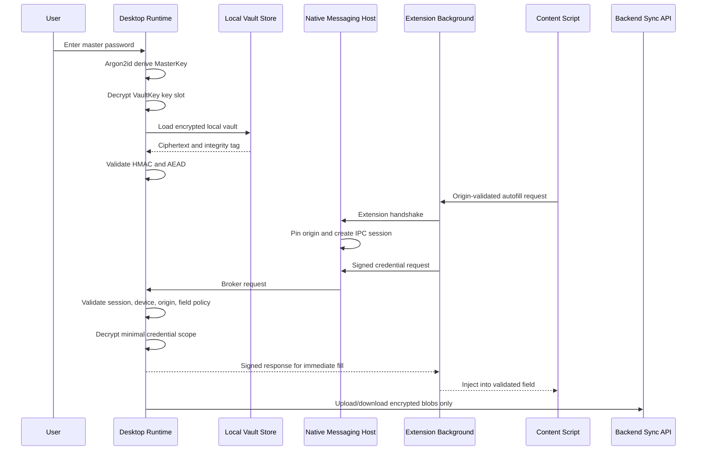

# End-to-End Secure Runtime Flow

## Failure Modes

- Any schema parse failure is denied.
- Any IPC counter replay is denied.
- Any origin mismatch is denied before decryption.
- Any local vault integrity failure prevents unlock.
- Any expired session locks runtime secrets before serving requests.

